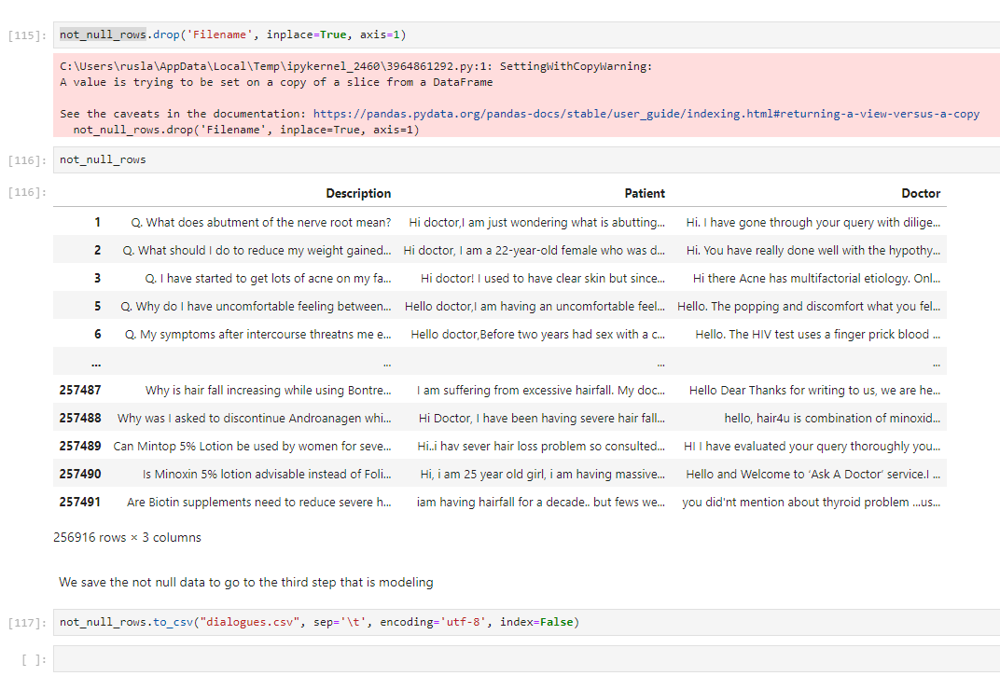

# Part 2 - Creation of the Medical Dataset

[back](../README.md)

In this part we are going to build the Datasets that will be used create the **Medical Model**

Once we have created our enviorment in the  part 1. We will create our Dataset to create our model.

```
jupyter lab
```


Let us go the the second folder called 2-data.

There we load the **2-Data.ipynb**  notebook


This notebook will create the dataframes in csv format for each document that are int he folder Medical-Dialogue-System

```
C:.

├───data
│   ├───csv
│   ├───dialogue_0
│   ├───dialogue_1
│   ├───dialogue_2
│   ├───dialogue_3
│   ├───dialogue_4
│   
├───Medical-Dialogue-System
└───tools

```

and saved in the ./data./csv/ 

Then those csv will be cleaned and merged into single file called `dialogues.csv`



This csv has 256916 dialogues between a Patient and Doctor.

In the following part we are going to build the model. [3-Modeling](../3-Modeling/README.md)
