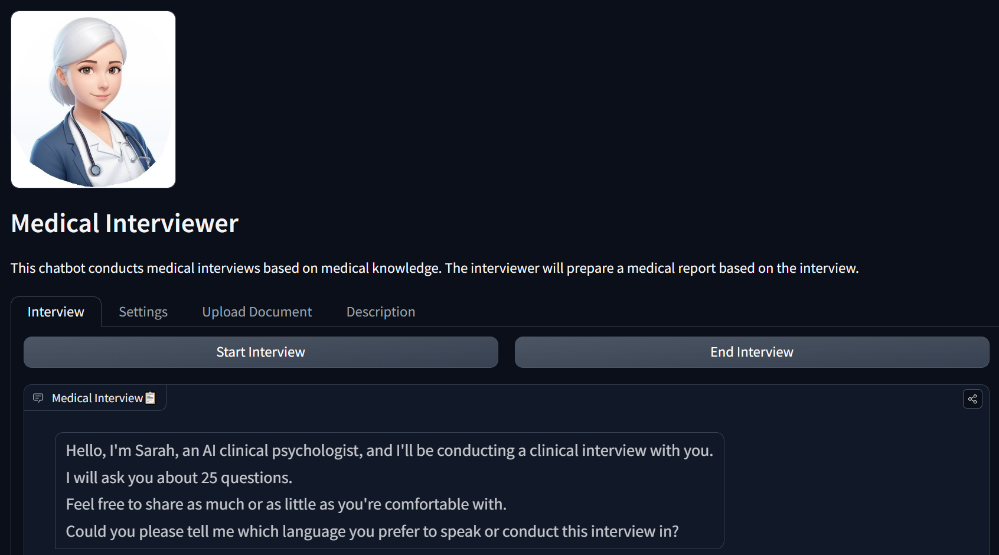

# Medical Interviewer


Medical Interviewer is an AI platform designed to simulate medical interviews based on psychological and medical knowledge. This platform is meant for educational, research, and preliminary assessment purposes but should **not** be used as a substitute for professional medical advice.

## Disclaimer
- This is a simulation tool, and information shared is confidential but **should not** include sensitive data.
- Always seek professional medical advice from qualified healthcare providers.

## Features
### 1. Simulated Interviews
- Conducts interviews with medically relevant and psychologically informed questions.
- Interviews can be customized by selecting different interviewers with unique backgrounds and approaches:
    - **Sarah**: Compassionate experience in trauma and family therapy.
    - **Aaron**: Direct and specialized in stress management, trauma, and military-related cases.

### 2. Natural Language Processing (NLP)
- Uses **LangChain** to create NLP chains that drive the interview and report generation processes.
- Understands user input and generates contextually relevant follow-up questions.

### 3. Voice Interaction
- Enables voice-based conversation by converting text to speech (TTS) and transcribing user responses using **Whisper** speech-to-text technology.

### 4. Medical Report Generation
- Automatically generates detailed medical reports based on the interview session.
- Users can download the report in PDF format.

### 5. Document Upload and Report Generation
- Users can upload TXT, PDF, or DOCX files, and the system will generate a report from the document's content.

### 6. Multi-Language Support
- Supports interviews and report generation in multiple languages.

### 7. Retrieval-Augmented Generation (RAG) and Document Retrieval
- Utilizes **RAG** to retrieve relevant data from indexed medical and psychological resources such as DSM-5, PDM-2, Big Five Traits, etc., ensuring contextually accurate interview questions.

## Usage

### Start an Interview
1. Choose an interviewer (Sarah or Aaron).
2. Start the interview in either text or voice format.
3. The system will guide you through a series of questions, designed to simulate a medical interview.

### Upload Documents
1. Navigate to the "Upload Document" tab.
2. Upload your medical document (TXT, PDF, or DOCX).
3. Generate a report based on the content of the document, which will be available for download.

### Settings
- Customize your experience by enabling or disabling audio interaction.
- Choose between available interviewers, each providing a unique style and focus.

## Technical Overview
The system uses a combination of:
- **NLP** for question generation and contextual relevance.
- **FAISS Indexing** for document similarity and retrieval of relevant medical knowledge.
- **RAG** to ensure contextually relevant and accurate interview processes.
- **Gradio** for the user interface, allowing text and audio inputs with real-time responses.
- **Whisper** and **TTS** for audio interaction, enabling real-time simulated voice-based interviews.

## Installation

To run the application locally:

1. Clone the repository:
   ```bash
   git clone https://github.com/ruslanmv/ai-medical-chatbot
   cd ./ai-medical-chatbot/8-Interviewer/hf
   ```

2. Install the dependencies:
   ```bash
   pip install -r requirements.txt
   ```

3. Launch the application:
   ```bash
   python app.py
   ```

## License
This project is licensed under the MIT License. See the [LICENSE](../LICENSE.txt) file for more details.
