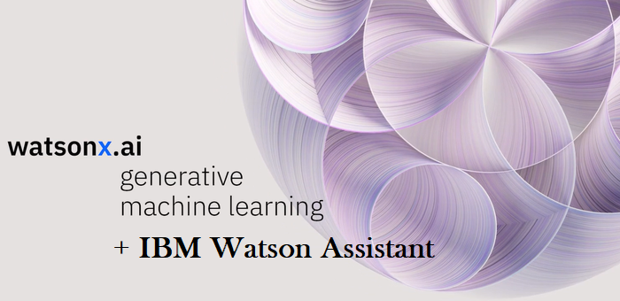
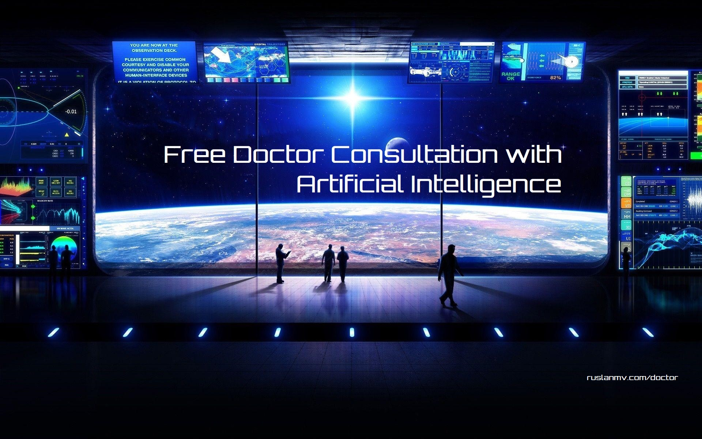
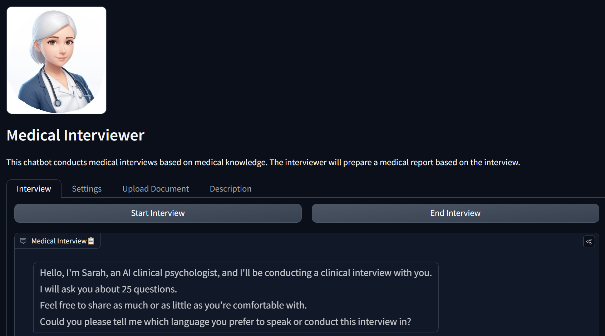
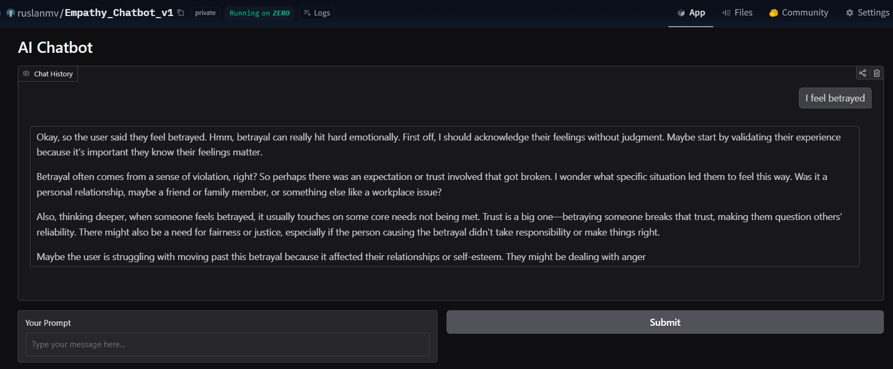

# Doctor Consultation with Artificial Intelligence.

*Release:  **April 2024***

Hello everyone,  the purpose of this repository is  create a  a simple program that will answer medical questions by using the latest technologies of **IBM**.

The aim of this program is help people who require help.  This program does not replace a real doctor but help to identify the possible health solution.

The technologies which will use is **WatsonX** of **IBM** and **Watson Assistant.**

**Watsonx.ai** is part of the IBM watsonx platform that brings together new generative AI capabilities, powered by foundation models, and traditional machine learning into a powerful studio spanning the AI lifecycle. With watsonx.ai, you can train, validate, tune, and deploy generative AI, foundation models, and machine learning capabilities with ease and build AI applications in a fraction of the time with a fraction of the data.

We are going to use  **Foundation Models**  and test different models such as:

- **flan-ul2-20b**  - It is an encoder decoder model based on the T5 architecture and instruction-tuned using the Fine-tuned LAnguage Net.Model by Google
- **mt0-xxl-13b**  - An instruction-tuned iteration on mT5.Model by BigScience
- **gpt-neox-20b** - A 20 billion parameter autoregressive language model trained on the Pile.Model by EleutherAI
- **flan-t5-xxl-11b**  - It is an 11 billion parameter model based on the Flan-T5 family.Model by Google
- **mpt-7b-instruct**  - It is a decoder-style transformer pretrained from scratch on 1T tokens of English text and code. 

The structure of the program contains 5 parts.

1. [**Environment creation**](./1-Environment/README.md)

   Here we are going to create the environment to create the models locally that later can be used

2. [**Creation of the Medical Dataset.**](./2-Data/README.md)

   In this part we are going to build the Datasets that will be used create the **Medical Model**

3. [**Creation of the model by using RAG**](./3-Modeling/README.md)
   In this part we will perform feature engineering and create the model

4. [**Finetuning Models for the Medical Chatbot**](./6-FineTunning/README.md)
   We create a custom model based on medical information

5. [**Multimodal Medical Chatbot**](./7-Multimodal/README.md)
   We develop a medical chatbot multimodal, that from images can give you a description of the issue. We analazize different Medical Images Datasets.

## Chatbot with WatsonX

**Implementation of a chatbot with WatsonX in production.**

Here we will create a chatbot with the capability to answer questions by using the Model created before.
For Production in WatsonX you can checkout this repo

[Watsonx-Assistant-with-Milvus-as-Vector-Database](https://github.com/ruslanmv/Watsonx-Assistant-with-Milvus-as-Vector-Database)

## Chatbot with Custom LLM 
We have also developed another version which uses a custom LLM 

[Medical-Chatbot-with-Langchain-with-a-Custom-LLM](https://github.com/ruslanmv/Medical-Chatbot-with-Langchain-with-a-Custom-LLM)

## Playground Demo 

**Medical-Chatbot by RAG method**.

[https://huggingface.co/spaces/ruslanmv/Medical-Llama3-Chatbot](https://huggingface.co/spaces/ruslanmv/Medical-Llama3-Chatbot)

**Medical Chatbot by using Medical-Llama3-8B**

[https://huggingface.co/spaces/ruslanmv/Medical-Llama3-Chatbot](https://huggingface.co/spaces/ruslanmv/Medical-Llama3-Chatbot)

## Fine-tunning Models with ai-medical chatbot

Currently there are two base models that were pretrained with ai-medical-chatbot

## Meta Llama 3
This repository provides a fine-tuned version of the powerful Llama3 8B model, specifically designed to answer medical questions in an informative way. It leverages the rich knowledge contained in the AI Medical Chatbot dataset.

[Medical-Llama3-8B](https://huggingface.co/ruslanmv/Medical-Llama3-8B)

The latest version of the Medical Llama 2 v2 with an improved Chatbot Interface in Google Colab

[Medical-Llama3-v2](https://huggingface.co/ruslanmv/Medical-Llama3-v2)

## Mixtral-7B
Fine-tuned Mixtral model for answering medical assistance questions. This model is a novel version of mistralai/Mistral-7B-Instruct-v0.2, adapted to a subset of 2.0k records from the AI Medical Chatbot dataset, which contains 250k records . The purpose of this model is to provide a ready chatbot to answer questions related to medical assistance.

[Medical-Mixtral-7B-v2k](https://huggingface.co/ruslanmv/Medical-Mixtral-7B-v2k)

For more details how was pretrained you can visit this post [here](https://ruslanmv.com/blog/How-to-Fine-Tune-Mixtral-87B-Instruct-model-with-PEFT)

> Let us use the best technologies in the world to help us. 

## Medical Interviewer

Chatbot that perform medical interview

For more details visit [this](./8-Interviewer/README.md)

## DeepSeek-R1-Distill-Llama-8B

Currently we are a developing also a new AI model in collaboration with the [Tilburg University](https://www.tilburguniversity.edu/), to create a new novel model able to understand your feelings.

The study of emotions and their underlying needs is a critical component of understanding human communication, particularly in contexts such as psychology, nonviolent communication (NVC), and conflict resolution. Emotional states often manifest as evaluative expressions—terms like "betrayed," "belittled," or "manipulated"—which not only convey subjective experiences but also point to unmet needs such as trust, respect, or autonomy. Effectively mapping these evaluative expressions to their associated feelings and corresponding needs is vital for creating tools that enhance emotional understanding and foster constructive dialogue.

You can test our current model [here](
https://huggingface.co/spaces/ruslanmv/Empathy_Chatbot_v1)

For more details of this project click [here](https://github.com/energycombined/empathyondemand)

## Contributing

Please free to contribute following the standard guidelines for submitting patches and additions or solutions. Feel free to submit issues and enhancement requests.

To more information visit www.ruslanmv.com

Copyright 2024 Ruslan Magana Vsevolodovna This program is distributed under the terms of the GNU Lesser General Public License.

