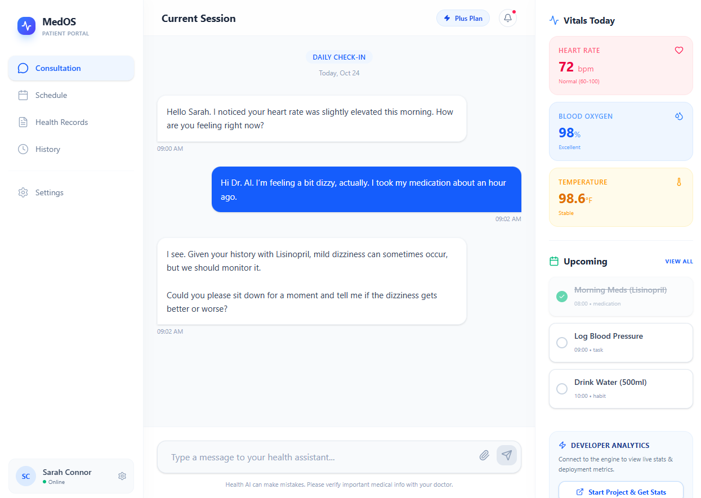
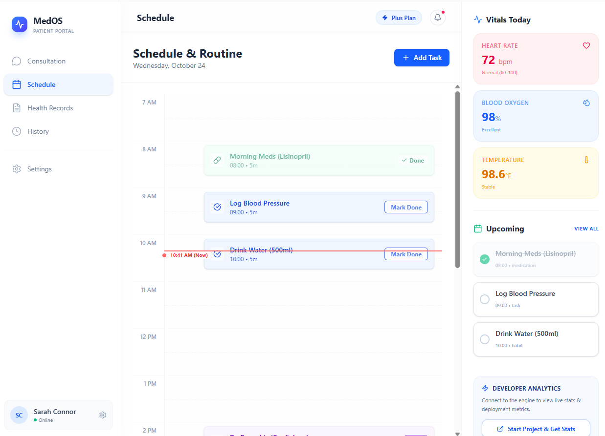
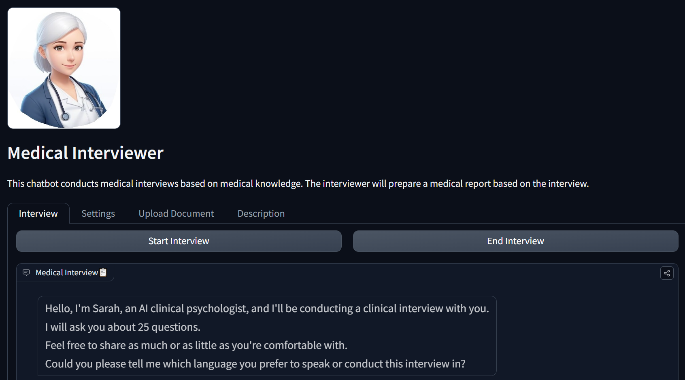
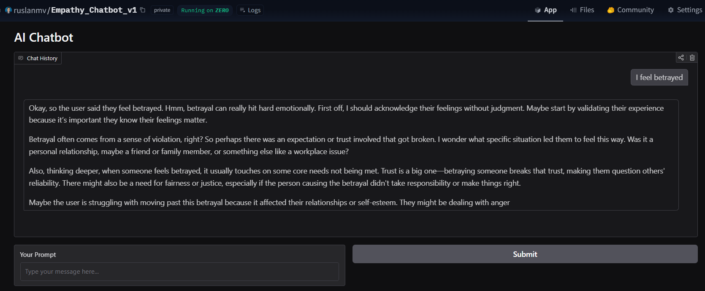
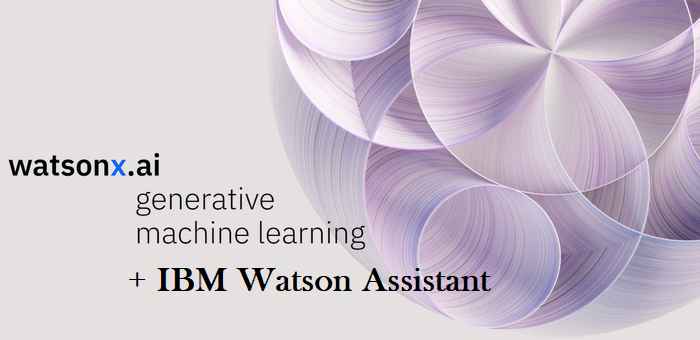

<div align="center">


# AI Medical Chatbot

### Healthcare is a human right. AI makes it free.

<br/>

[](https://huggingface.co/spaces/ruslanmv/MediBot)
&nbsp;&nbsp;
[](https://github.com/ruslanmv/ai-medical-chatbot)

<br/>

**Free. Open source. 13 languages. No sign-up. No tracking. No ads. Ever.**

<br/>

[Use it now](https://huggingface.co/spaces/ruslanmv/MediBot) &nbsp;&bull;&nbsp; [What you get](#-what-you-get) &nbsp;&bull;&nbsp; [The stack](#-the-open-source-stack) &nbsp;&bull;&nbsp; [Run it yourself](#-run-it-yourself) &nbsp;&bull;&nbsp; [Join us](#-contributing)

<br/>

<a href="https://huggingface.co/spaces/ruslanmv/MediBot">

</a>

<br/>

</div>

---

## Why this exists

Billions of people cannot afford a doctor. Millions search the internet for health answers and find ads, misinformation, or paywalls.

We believe the best medical AI in the world should be **free, private, and available to every human on earth** — regardless of where they live, what language they speak, or how much money they have.

This is that project. Built by the community. Free forever.

> **Important:** This does not replace a doctor. It helps you understand your health, ask better questions, and know when to seek professional care.

---

## What you get

### MedOS Platform

The full medical AI experience — chat with the AI, track your health, manage medications, and more.

<div align="center">
<a href="https://huggingface.co/spaces/ruslanmv/MediBot">

</a>
</div>

<br/>

- Ask anything about your health
- 13 languages, auto-detected
- Voice input — speak your symptoms
- Emergency detection with local numbers
- Health tracker (meds, vitals, appointments)
- Medicine scanner (point your camera)
- Works on any phone as a PWA
- 100% private, zero data stored

### Health Tracker

Your personal health dashboard — private, encrypted, on your device.

<div align="center">
<a href="https://huggingface.co/spaces/ruslanmv/MediBot">

</a>
</div>

<br/>

- **Medications** with dose tracking and streaks
- **Schedule** timeline with live "now" indicator
- **Vitals** — blood pressure, glucose, temp, weight, heart rate, O2
- **Appointments** with doctor, location, and reminders
- **Records** — upload and organize health documents
- **EHR Wizard** — build your medical history in 5 steps
- **Export** everything as JSON or print for your doctor

---

## How it works

```
You speak or type your symptoms
              |
         [ MedOS AI ]
              |
     Llama 3.3 70B ──── grounded in WHO, CDC, NHS guidelines
              |
     Clear answer in your language
              |
     Emergency detected? ──> local emergency number instantly
```

The AI runs on **Llama 3.3 70B** via free inference providers. It is grounded in medical guidelines from **WHO, CDC, NHS**, and major medical societies. It does not hallucinate treatment plans — it tells you what doctors would want you to know, and when to see one.

---

## The open source stack

Everything here is free and open. Every piece can be run independently, improved, or adapted for your community.

<br/>

<div align="center">

<a href="https://huggingface.co/spaces/ruslanmv/MediBot">

<br/>

</a>
<br/>
Full medical platform — chat, health tracker, medicines, 13 languages
<br/><br/>

---

<a href="https://huggingface.co/spaces/ruslanmv/Medical-Llama3-Chatbot">

<br/>

</a>
<br/>
Fine-tuned Llama3 8B on 250K medical Q&As
<br/><br/>

---

<a href="https://huggingface.co/spaces/ruslanmv/Medical-Interviewer">

<br/>

</a>
<br/>
AI that conducts a structured medical interview
<br/><br/>

---

<a href="https://huggingface.co/spaces/ruslanmv/Empathy_Chatbot_v1">

<br/>

</a>
<br/>
AI trained to understand emotions (with Tilburg University)
<br/><br/>

---

<a href="https://github.com/ruslanmv/watsonx-medical-mcp-server">

<br/>

</a>
<br/>
IBM WatsonX medical symptoms analysis via MCP protocol
<br/><br/>

---

<a href="./11-Medicine-Scanner/">

</a>
<br/>
Point your camera at a medicine box — AI reads the label for you
<br/><br/>

</div>

<br/>

### Full project map

| # | Project | What it does | Links |
|---|---|---|---|
| | **[MedOS Web App](./web/)** | Full medical platform — chat, health tracker, medicine inventory, 13 languages | [](https://huggingface.co/spaces/ruslanmv/MediBot) |
| | **[MedOS Backend](./9-HuggingFace-Global/)** | API server — auth, SQLite DB, LLM routing, emergency triage, RAG | [](./9-HuggingFace-Global/) |
| | **[Medicine Scanner](./11-Medicine-Scanner/)** | Camera scan of medicine labels via Qwen2.5-VL multimodal AI | [](./11-Medicine-Scanner/) |
| | **[Medical Llama3 8B](https://huggingface.co/ruslanmv/Medical-Llama3-8B)** | Fine-tuned Llama3 on 250K medical Q&A pairs | [](https://huggingface.co/ruslanmv/Medical-Llama3-8B) |
| | **[Medical Llama3 v2](https://huggingface.co/ruslanmv/Medical-Llama3-v2)** | Improved medical Llama3 with enhanced chatbot interface | [](https://huggingface.co/ruslanmv/Medical-Llama3-v2) |
| | **[Medical Mixtral 7B](https://huggingface.co/ruslanmv/Medical-Mixtral-7B-v2k)** | Fine-tuned Mixtral for medical assistance | [](https://huggingface.co/ruslanmv/Medical-Mixtral-7B-v2k) |
| | **[Medical Interviewer](./8-Interviewer/)** | AI that conducts structured medical interviews and generates reports | [](https://huggingface.co/spaces/ruslanmv/Medical-Interviewer) |
| | **[Empathy Chatbot](https://github.com/energycombined/empathyondemand)** | AI understanding emotions and unmet needs (Tilburg University) | [](https://huggingface.co/spaces/ruslanmv/Empathy_Chatbot_v1) |
| | **[WatsonX MCP Server](https://github.com/ruslanmv/watsonx-medical-mcp-server)** | IBM WatsonX medical symptom analysis via MCP protocol | [](https://github.com/ruslanmv/watsonx-medical-mcp-server) |
| | **[RAG Pipeline](./3-Modeling/)** | Medical knowledge retrieval with FAISS / Milvus / ChromaDB | [](./3-Modeling/) |
| | **[Medical Dataset](./2-Data/)** | 250K curated medical Q&A pairs for training | [](./2-Data/) |
| | **[Fine-tuning](./6-FineTunning/)** | Notebooks to fine-tune your own medical LLMs | [](./6-FineTunning/) |

---

## Architecture

```
web/                           Frontend (Next.js 14, Tailwind, PWA)
  20 views, dark/light mode, 13 languages
  Health tracker, EHR wizard, medicine scanner
  Voice input, notifications, offline support

9-HuggingFace-Global/         Backend (Next.js API + SQLite)
  Llama 3.3 70B via free providers (Groq, HF, Gemini)
  23-topic medical RAG, 19 emergency triage patterns
  Email auth, admin dashboard, health data sync

11-Medicine-Scanner/           Medicine Label AI (Gradio + Qwen2.5-VL)
  Camera scan -> structured JSON
  REST API for mobile integration

12-MetaEngine-Nearby/           Nearby care finder metaengine
  Pharmacies/doctors near current location
  OSM provider, ranking, route metadata

13-MedOS-Family/      MedOS Family family layer
  Family tree, MedOS client linking, adult/child/admin modes
  Monthly health timelines and family admin dashboard
```

| | Vercel | HuggingFace Space |
|---|---|---|
| **Role** | Frontend only | Frontend + Backend + DB |
| **Cost** | Free | Free |
| **Deploy** | `git push` | `bash scripts/deploy-hf.sh` |

---

## Run it yourself

### Use it now (zero install)

[](https://huggingface.co/spaces/ruslanmv/MediBot)

Just click. No account. No install. Free.

### Run locally

```bash
git clone https://github.com/ruslanmv/ai-medical-chatbot.git
cd ai-medical-chatbot/web
npm install && npm run dev
```

Open `http://localhost:3000`. Done.

### Deploy your own

```bash
# Deploy to HuggingFace Spaces (free)
HF_TOKEN=hf_xxx bash 9-HuggingFace-Global/scripts/deploy-hf.sh

# Deploy to Vercel (free tier)
# Root Directory = web, Framework = Next.js
# Env: NEXT_PUBLIC_BACKEND_URL = your HF Space URL
```

### Train your own medical model

```bash
cd 6-FineTunning
# Follow the notebooks to fine-tune Llama3 or Mixtral
# on 250K medical Q&A pairs
```

---

## Contributing

This project exists because people like you contribute. Every fix, every translation, every idea makes healthcare more accessible for someone, somewhere.

[](http://makeapullrequest.com)
[](https://opensource.org/licenses/Apache-2.0)
[](https://python.org)
[](https://typescriptlang.org)
[](https://nextjs.org)

**Ways to help:**
- Add a language translation (we support 20, the world has 7,000)
- Improve medical knowledge accuracy
- Report bugs or suggest features
- Share the project with someone who needs it
- Star the repo so others find it

```bash
git clone https://github.com/ruslanmv/ai-medical-chatbot.git
cd ai-medical-chatbot
git checkout -b my-improvement
# Make your changes, then open a Pull Request
```

[](https://starchart.cc/ruslanmv/ai-medical-chatbot)

---

## License

Apache 2.0 — use it, modify it, deploy it, share it. **Free forever.**

---

<div align="center">


<br/><br/>

**Made with care by [Ruslan Magana Vsevolodovna](https://ruslanmv.com) and the open source community**

[](https://ruslanmv.com)
[](https://github.com/ruslanmv)
[](https://huggingface.co/ruslanmv)

<br/>

*The best technology in the world should serve everyone — not just those who can pay for it.*

*Let us use it to heal.*

</div>
